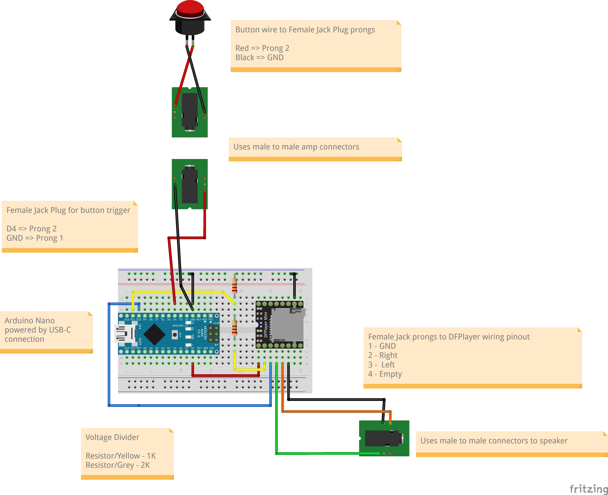

# Animatronic-SFX Audio Trigger Device

## Abstract
The Animatronic-SFX system is a compact and easy-to-install audio trigger device, ready for any type of event. It was developed as part of PVNet’s involvement in the Promenade’s Halloween event. The device consists mainly of an **Arduino Nano** containing all the firmware and a **DFPlayer Mini Module** to produce sound output when triggered by a button. The design supports **3.5 mm jack connections** for modularity between the trigger button and speakers.

The hardware features a **custom protective case** for durability and quick setup. Built with custom Arduino firmware using the **DFPlayer Mini Fast** library, and schematics designed in **Fritzing**—the device uses precise soldering for long-term reliability in demanding event environments. This design delivers **immersive, synchronized sound effects** for animatronics while remaining low-cost, portable, and adaptable to diverse themed events.

---

## Methodology
- Reviewed reference circuits from **Indrek Luuk** and **Just Baselmans** to understand the DFPlayer Mini module.  
- Default Arduino DFPlayer Mini libraries failed to detect the module despite correct wiring.  
- Switched to the **DFPlayer Mini Fast** library by PowerBroker2, which successfully connected (confirmed via flashing blue LED).  
- Modified firmware for faster triggering. Initially used the Nano’s reset button (slow response), later replaced with a **dedicated switch** for instant triggering.  
- Edited MP3 file to remove leading silence, improving playback speed.  
- Designed a **Fritzing schematic** and revised connectors to **3.5 mm female jacks** for modular audio and button connections.  
- Soldered and tested wiring via **trial-and-error** (audio: GND, DACR, DACL → prongs 1, 2, 3; button: GND → GND, prong 2 → D4).  
- Produced **five boards**, all tested for continuity and functionality.  
- Designed and built a **custom casing** with openings for audio, trigger, and USB-C power, including a wall-mount flap and internal stability features.  

Result: a **durable, low-cost, and portable** audio-trigger device completed within one week.

---

## Implementation:

### Material List
- DFPlayer Mini  
- Arduino Nano (or any microcontroller compatible with DFPlayer Mini)  
- Trigger Button  
- 3 × 3.5mm Female Jack Plug  
- 2 × 3.5mm Male-to-Male Connector  
- Speaker for sound  
- MicroSD card (< 32GB)  
- USB Cable (for power)  
- Resistors  
- Wires  
- Breadboard / Soldering Board  

### Steps
1. Copy and paste the `sound.ino` Arduino code into a new Arduino IDE file and upload it to the Nano.  
2. Gather all materials.  
3. Follow the provided Fritzing wiring diagram.
   

4. **Check wiring functionality**:  
   - Connect Arduino Nano to DFPlayer Mini and insert SD card.  
   - Successful connection is confirmed by DFPlayer’s **blue LED** lighting when triggered.  
5. Add a button for testing; LED should flash when pressed.  
6. Add resistors.  
7. Solder jack plugs and button wiring.  
8. Fit the board into its casing.  
9. Connect USB to power.  
10. Attach connectors to speaker and trigger button.  
11. Press the button → sound plays instantly.  

---

## Team Members
- **Tiffany Lin** – Project Lead, Board Design, Firmware, Schematics  
- **Yuichi Kurino** – Device Case & Button Handle Design  
- **Keegon Grohman** – Soldering Assistant  
- **Dickson Lin** – Soldering Assistant  

---

## References
- [PowerBroker2 DFPlayerMini_Fast Library](https://github.com/PowerBroker2/DFPlayerMini_Fast)  
- *Circuit Journal*: Wiring DFPlayer Mini (MP3 Module) to Arduino (Stereo/Mono Diagrams)  
- *Best Way to Play Audio on Arduino! DFPlayer mini / MP3-TF-16p Tutorial*  
